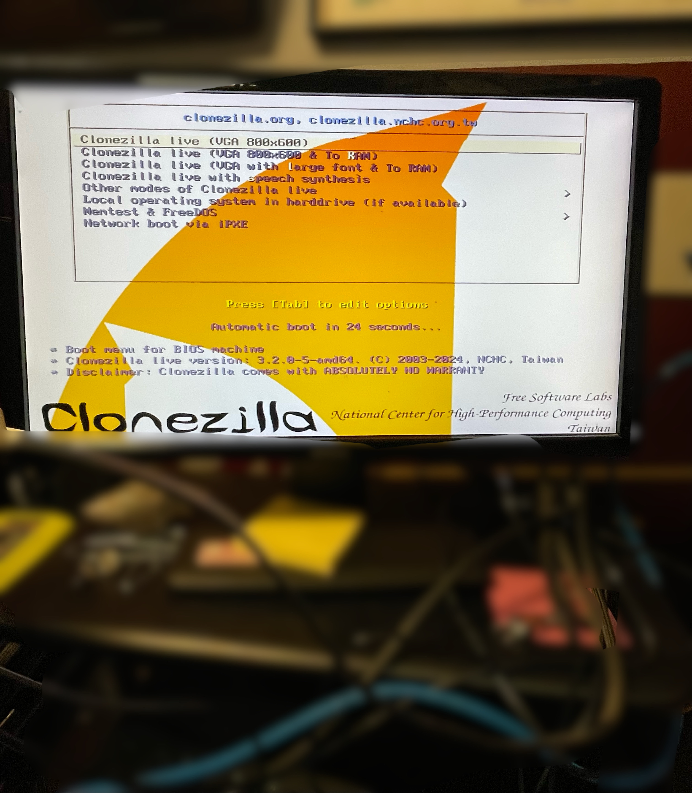
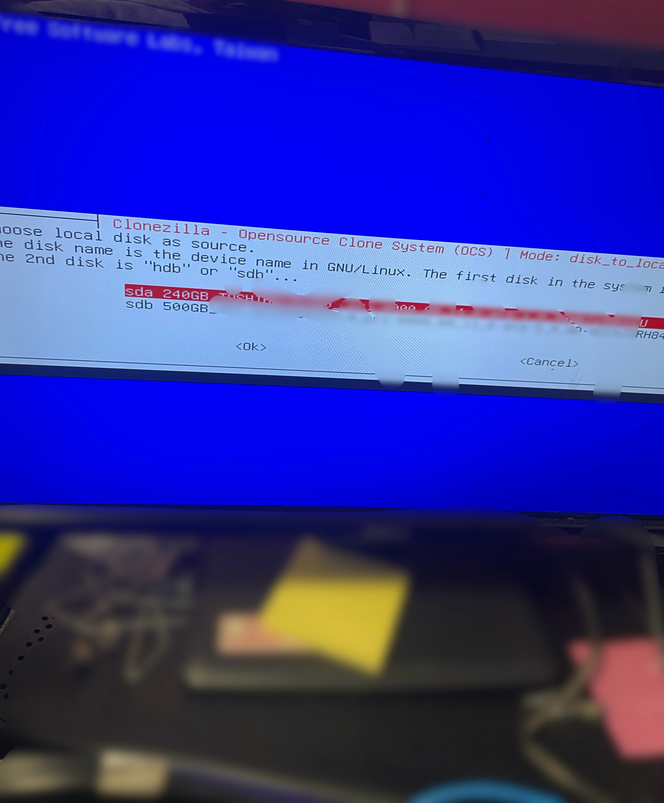
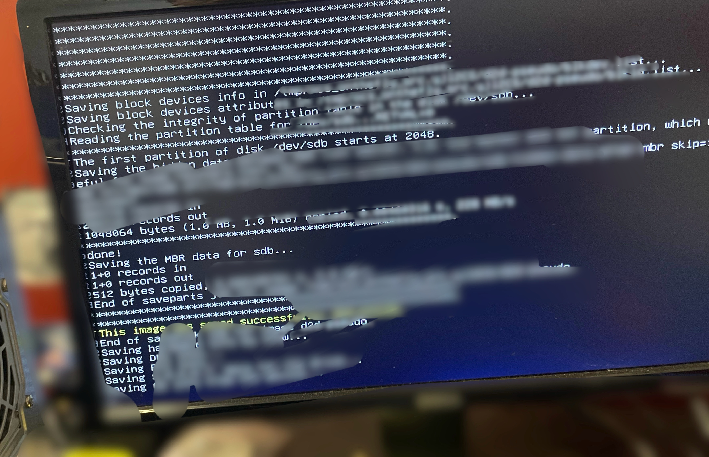

# emergency-pc-upgrade-clonezilla
Upgraded an emergency services PC by migrating the system to an SSD using Clonezilla, validating user profiles, improving storage, configuring secure access, and optimizing performance for faster, more reliable operation.

## **Project Overview**
This project focused on improving the dependability and performance of a PC used in an emergency services environment. The system was fully migrated to a new SSD for faster operation, with the original HDD repurposed for additional storage. The process included data integrity checks, user account verification, system cleaning, and security configuration to ensure uninterrupted services availability.

## **Key Activities Completed**
- Performed a full disk-to-disk clone using Clonezilla
- Migrated the operating system and data from HDD to SSD
- Validated successful boot and system integrity after migration
- Repurposed the old HDD for storage
- Configured RDP for secure remote access
- Managed local user accounts and permissions
- Cleaned the system internally to improve cooling and longevity
- Verified performance improvements and tested system stability

## **Screenshots**

### **1. Clonezilla Boot interface**
Booting into Clonezilla to begin the disk-to-disk cloning process.

### **2. Selecting Source and Target Drives**
Choosing the correct system drive (source) and SSD upgrade drive (target) prior to cloning.

### **3. Cloning Process in Progress**
Clonezilla performing a sector-by-sector copy of the system drive to the new SSD.

### **4. Successful Clone Completion**
Confirmation that the imaging and disk replication process completed without errors.

### **5. Post-Clone System Verification**
Validating local users, security policies, and system settings after migrating to the new SSD.

## **Tools & Techniques**
- **Disk Imaging & Backup Tools**
    - Clonezilla
    - Disk-to-disk cloning procedures
- **System Administration**
    - Local user configuration
    - RDP setup for secure remote access
    - Group Policy basics
- **Hardware Skills**
    - SSD installation
    - Internal cleaning for airflow optimization
- **Security & Reliability**
- Data integrity validation
- System hardening
- Reducing failure points for emergency-service systems

## **Purpose**
The goal of this project was to increase system dependability and performance in a critical environment where uptime is essential. By migrating to an SSD, expanding storage capacity, enabling secure remote access, and improving system thermals, the workstation now performs faster, runs cooler, and is better suited for demanding emergency service operations.
